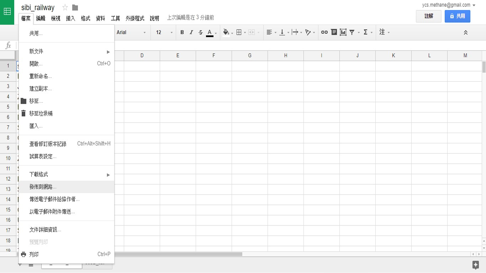
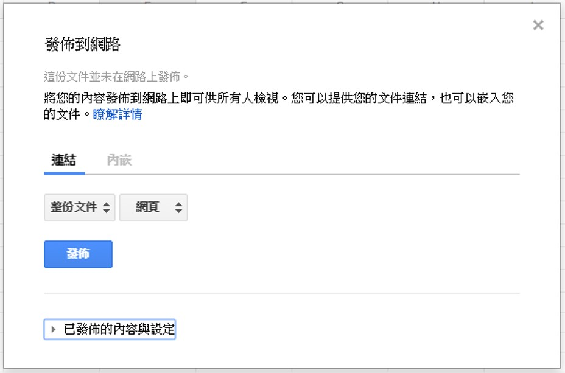

<style>
body { background-color:#f2f2f2; }
</style>

### 寫在前頭

一般來說，常見的資料庫不外乎MySQL、mongodb等等。但有時候覺得我資料量好像沒這麼多，不想要只存在我的本機端，但是想到要去弄一個server弄SQL資料庫等等又有點懶。

後來想到google大神的google試算表(Google sheets)，想說直接利用R存取google試算表的資料應該就可以簡化很多操作吧。

如果你還不知道什麼是google試算表或是你沒用過，你可以去直接上去[Google Sheets](https://www.google.com.tw/intl/zh-TW/sheets/about/)先玩玩看。

### 套件安裝

利用googlesheets套件可以輕鬆地串接R與存取在雲端上的google試算表。
```{r eval=FALSE}
install.packages('googlesheets')
library(googlesheets)
```

### 連結google帳戶

安裝好套件後，首先第一步驟是要連結你的google帳戶，在此之前你可以先去隨意於網頁上建立一個測試用資料表，但也可以不用，googlesheets套件好用之處在於你可以完全利用R去建立、存取和刪除你帳戶中的任何試算表。

利用這個函數`googlesheets::gs_auth()`建立與google帳戶的授權

```{r eval=FALSE}
gs_auth(new_user = TRUE) # 與帳戶建立新的受權
gs_user() # 查看user資料
```
此時會自動幫你開啟瀏覽器，你必須於瀏覽器中登入你的google帳號。登入成功後瀏覽器會顯示訊息，之後便可回到R的執行環境之下。
`gs_user()`這個函數可以查看該帳戶的資訊。通常執行完登入授權後我會例行性檢查一下確保登入的是正確的帳號。

### 查看google試算表

使用`gs_ls()`這個函數可以直接查看該帳戶中所有可用的google試算表，如果該帳戶中無任何可存取的試算表他就會顯示訊息告知你無任何試算表可使用
```{r } 
library(googlesheets)
#gs_ls() # 查看帳戶中的google試算表list
library(knitr)
kable(gs_ls()[, 1:6])
```

### 讀取

在此之前先簡略介紹一下Google Sheet中的一些名詞。

一般來說若使用者使用googlesheet服務中建立一個新的試算表檔案，該檔案稱為"Spreadsheet"，而每個spreadsheet中可以有很多個分頁，這些分頁稱為worksheet，使用者可以自由針對這些worksheet命名，就像是Excel一樣，如果真的沒使用過Excel或是Google Sheet，就建議可以先使用瀏覽器去玩玩看。

`gs_tittle()` : 註冊帳戶中可使用的Spreadsheet進入R，function內的參數為該Spreadsheet名稱。
`gs_read()`   : 讀取選擇的spreadsheet中的某個Worksheet。

當執行成功後，Console會顯示成功訊息。將他指派於一個物件存於工作中的Enviroment中，若你呼叫該物件時，他會告訴這個Spreadsheet的相關資訊。例如他是published或是Private的Spreadsheet，或是告訴你這個spreadsheet中有幾個worksheet，這對於使用者或開發者其實很實用資訊，便於在日後發生問題時讓你檢查。

利用`gs_title()` 註冊帳戶中一個Spreadsheets，再利用`gs_read()`去讀取Spreadsheet中的其中一個worksheet，讀取後他將存成一個data frame。

```{r eval=FALSE}
test_gs <- gs_title('testFile') # 讀取帳戶中名為"testFile"的 Spreadsheet
UBspot <- gs_read(ss=test_gs, ws = "工作表1", skip=0) # ss = spreadSheet, ws = worksheet

```

`gs_url()`    : 利用連結註冊，function內的參數為該Spreadsheet的公開連結。
`gs_read()`   : 讀取選擇的spreadsheet中的某個Worksheet。

可利用`gs_url()`註冊的spreadsheet分為兩類，一種是已發布的公開spreadsheet，另一種是一般私人spreadsheet。

要利用私人的Spreadsheet，一樣需要取得帳戶授權，步驟如上面相同，只是註冊spreadsheet時由`gs_title()`改成`gs_url()`，而已經發佈且公開的Spreadsheet則不需要帳戶授權的步驟，因為是公開發佈的資料，所以任何人都可以透過該URL去註冊這個Spreadsheet。

但通常公開發佈的資料表並不會開放權限給外人寫入，只有讀取功能而已。但相對地，如果你有一份資料想要提供給超多人使用，這就是一個很好的途徑，不然私人資料表你就得透過google的共用功能去分享給別人。

> P.S. 因為我發現超多人搞混"發佈spreadsheet"與"公開spreadsheet"，加上我之前也曾搞錯過，所以特別截圖筆記下來。


檔案>發佈到網路


整份文件發布到網路上

發佈成功後，便可以取得連結，在不需要帳戶登入或授權情況下可以註冊該spreadsheet。除此之外，對R來說使用`gs_url()`最重要的場合就是讓shinyapps去讀取這個資料表，這部分後面會有詳盡的範例。

```{r eval=FALSE}
Purl <- "https://docs.google.com/spreadsheets/d/1aoXyR7foNOsSergX39cEalNGOJNBMrWbIog0dASocpw/edit?usp=sharing"
sibi_spreadsheet <- gs_url(Purl)
sibidf <- gs_read(ss=sibi_spreadsheet, ws = "K3_station_list", skip=0)
```

### 寫入新的資料

很多時候，可能與google試算表之間的工作在我們讀入資料後就結束了，因為接下來便是本機端的工作了，而且並不是所有的google試算表都有將權限開放至所有使用者，很多的協作資料大都只有開放讀取權限給其他使用者，以避免有些兩光的傢伙一不小心將資料全部毀掉。


```{r eval=FALSE}
newdata <- data.frame(name=c("Ulaanbaatar Railway Station", "Ulaanbaatar Airport"), 
                    eng = c("Ulaanbaatar Railway Station", "Ulaanbaatar Airport"),
                    lat = c(47.908592, 47.840388),
                    lng = c(106.883938, 106.769976)
                    )
gs_add_row(ss=test_gs, ws = "工作表1", input = newdata) # 新增資料

```

在你已授權的帳戶中建立一個新的spreadsheet。

```{r eval=FALSE}
# 建立新的google sheet
gs_new("CWB-data", ws_title = "Beiliao", input = Beiliao, trim = TRUE, verbose = FALSE)
```

在已註冊的Spreadsheet中新增一個新的worksheet。

```{r eval=FALSE}
# 在CWB-data中建立新的worksheet
CWB_gs <- gs_title('CWB-data')
gs_ws_new(ss = test_gs, ws_title = "Zhudong", input = test2, trim = TRUE, verbose = FALSE)
```

### Shinyapps應用

好的，重點就是把google sheets當作資料庫，而shinnyapps的server.R可以連結進去sheets後取得資料，之後將拿到手的資料不管是要畫圖還是計算都隨你便。

程式碼在下面，Demo可以[按我](https://yichunsung.shinyapps.io/testgooglesheets/)

這樣的東西方便性在於，未來你要更新資料，你不必在把server.R打開來重新更新code，你可以直接上去Google Sheet增加資料就好，介面簡單直觀，對於不用R的工作夥伴而言也非常輕鬆可以協助更新資料。

**另外注意，**`gs_read()`**千萬記得放在**`shinyServer(function(input, output){}`**裡面，才會自動更新資料**

**server.R:**
```{r eval=FALSE}
library(shiny)
library(googlesheets)
library(plotly)

GTPurl <- "https://docs.google.com/spreadsheets/d/11VFUdSCfZahqIuaO5eAvtCyyIjpnnYkG4w7KliiY_fc/edit?usp=sharing"
GTPtest <- gs_url(GTPurl)


shinyServer(function(input, output) {
  GTPtestdf <- gs_read(ss=GTPtest, ws = "工作表1", skip=0)
  GTPtestdf$date <- as.Date(GTPtestdf$date)
  output$the_data <- renderDataTable({
    
    GTPtestdf
  })
  output$plotlyData <- renderPlotly({
    
    GTPdataplotly <- plot_ly(
      data = GTPtestdf, 
      x = GTPtestdf$date, 
      y = GTPtestdf$TA_Day,
      type = "scatter", 
      mode = "liners+markers"
    )
    GTPdataplotly
  })
})

```

**ui.R:**
```{r eval=FALSE}
library(shiny)
library(googlesheets)
library(plotly)

shinyUI(fluidPage(
  titlePanel("Quick demo"),
  sidebarLayout(
    sidebarPanel(
      dateRangeInput("dates", 
                     label = h3("date"), 
                     start = "2017-01-01", 
                     end = "2017-01-01", 
                     format = "yyyy-mm-dd"),
      selectInput("title", 
                  label = h3("station"), 
                  choices = c("title1", "title2", "title3"),
                  selected = "title1"),
      submitButton("Submit"),
      br()
    ),
    mainPanel(
      tabsetPanel(
        tabPanel("result",
                 dataTableOutput("the_data")),
        tabPanel("Plot", 
                 plotlyOutput("plotlyData"))
      )
    )
  )
))

```

### Reference

[Persistent data storage in Shiny apps](https://shiny.rstudio.com/articles/persistent-data-storage.html#gsheets)

[googlesheets套件作者Github](https://github.com/jennybc/googlesheets/issues/126)

[Reading data from google sheets into R](https://www.r-bloggers.com/reading-data-from-google-sheets-into-r/)

[googlesheets Basic Usage](https://rawgit.com/jennybc/googlesheets/master/vignettes/basic-usage.html#add-a-new-worksheet-to-an-existing-google-sheet)

### 聯絡我

完整的程式碼在我的[Github](https://github.com/yichunsung/R_Application/tree/master/map)中可以找到，歡迎去看看。